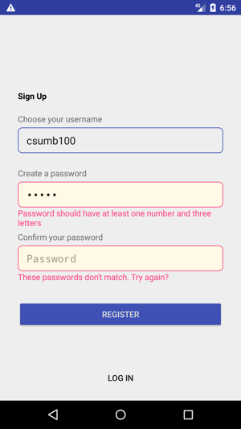
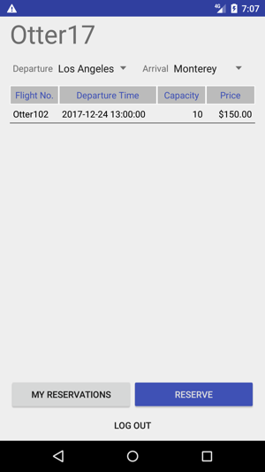

# Airline Ticket Reservation System
### Software Design Final Project @ CSUMB

    

       Main GUI  
    

    

        
        
        
    

    

        Create a correct account 
    

    <ol>
        <li>Select "Register"</li>
        <li>Username: Otter17</li>
        <li>Password: Otter17</li>
    </ol>
    

        
        
    

    

        Manage the system - Verify the new account
    

    <ol>
        <li>Login as Administrator</li>
        <li>Username: admin2</li>
        <li>Password: admin2</li>
    </ol>
    

        
    

    

        Create an incorrect account
    

    

        
        
    

    

        Create an incorrect account - Duplicated username
    

    <ol>
        <li>Select "Sign Up"</li>
        <li>Username: chris21</li>
        <li>Password: CHRIS21</li>
    </ol>
    

        
    

    <ol>
        <li>Select "Sign Up"</li>
        <li>Username: Otter17</li>
        <li>Password: Otter17</li>
    </ol>
    

        
    

    

        Reserve seat
    

    <ol>
        <li>Login as Otter17 (pwd: Otter17)</li>
        <li>Departure: Monterey</li>
        <li>Arrival: Seattle</li>
        <li>Number of tickets: 2</li>
    </ol>
    

        The System confirms it and displays 
        
    

    

        Reserve seat - One more trial
    

    <ol>
        <li>Departure: Los Angeles</li>
        <li>Arrival: Monterey</li>
        <li>Number of tickets: 6</li>
    </ol>
    

        
        
    

    

        The System confirms it and displays 
        
    

    

        Reserve seat - Handle No Seats Available
    

    <ol>
        <li>Departure: Monterey </li>
        <li>Arrival: Los Angeles</li>
        <li>Number of tickets: 10</li>
    </ol>
    

        
        
    

    <ol>
        <li>Departure: Monterey </li>
        <li>Arrival: Los Angeles</li>
        <li>Number of tickets: 5</li>
    </ol>
    

        The System confirms it and displays 
        
        
    

    

        Reserve seat - Handle No Flight Available
    

    <ol>
        <li>Departure: Seattle</li>
        <li>Arrival: Los Angeles</li>
        <li>Number of tickets: 1</li>
    </ol>
    

        
    

    

        Cancel reservation - Handle No Reservation
    

    <ol>
        <li>Login as "alice5" (pwd: csumb100)</li>
        <li>Select "My Reservations"</li>
    </ol>
    

        
    

